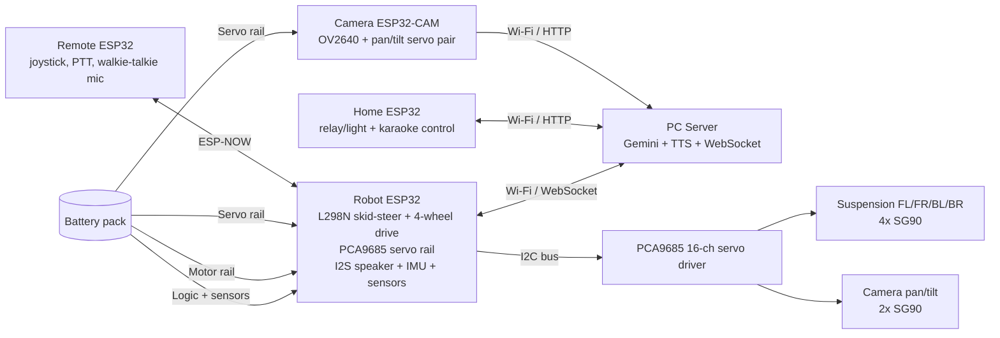

# Kaniye Companion Robot — Hardware Reference

This document matches the corrected physical chassis and control architecture:

- 4-wheel skid-steer, 4 DC gear motors, 1 dual H-bridge (L298N)
- 4 active suspension corners (4× SG90) on the robot chassis
- 2 camera servos (2× SG90) on the ESP32-CAM pan/tilt mount
- 6 SG90 servos total across the full robot
- All six servos are driven through a PCA9685 16-channel I2C servo driver
- A dedicated 5 V, 5 A+ buck converter powers the servo rail separately from the logic and motor rails

The robot emergency stop remains on GPIO13. GPIO0 is intentionally avoided due to boot-strapping behavior.

## System overview



## Bill of materials

| Item | Qty | Notes |
|---|---:|---|
| ESP32-WROOM development board (robot) | 1 | Main chassis controller |
| ESP32-CAM module | 1 | Camera node; 2× SG90 pan/tilt |
| Home ESP32 controller board | 1 | Room control / karaoke node |
| Remote ESP32 controller board | 1 | PTT + joystick + audio capture |
| DC gear motor, 4-wheel chassis | 4 | One per wheel, skid-steer |
| L298N dual H-bridge | 1 | Drives left/right motor pairs in parallel |
| SG90 servo motor | 6 total | 4 suspension corners + 2 camera pan/tilt |
| PCA9685 16-channel PWM/servo driver | 1 | Drives all 6 servos, shared I2C |
| MPU6050 IMU | 1 | Pitch/roll sensing for suspension auto-level |
| I2S DAC/amplifier (MAX98357A or equivalent) | 1 | Robot speaker output |
| Speaker | 1 | 4–8 Ω, powered from audio amp |
| WS2812B LED strip | 1 | Robot lighting |
| Electret mic with preamp | 2 | Remote walkie-talkie + home karaoke |
| 10 kΩ dual-axis joystick | 2 | Home + remote controller |
| Push buttons / PTT switches | 2+ | Per controller |
| Battery divider network | 1 | For robot battery voltage monitoring |
| LDR / light sensor | 1 | Ambient light telemetry |
| 5V buck converter, servo rail | 1 | Dedicated ≥5 A servo rail |
| 5V buck converter, logic rail | 1 | ESP32 + sensors + audio logic |
| 470–1000 µF electrolytic | 1–2 | At PCA9685 / servo power input |
| 100 nF + 10 µF decoupling | multiple | Near regulator outputs and modules |
| Fuse + reverse-polarity protection | 1 set | Per battery pack |
| Wiring and connectors | as required | 22–26 AWG signal, thicker motor leads |

## Robot node: drive, safety, and servo rail

### Robot pin table

| Signal | ESP32 pin | Direction | Connection |
|---|---:|---|---|
| Emergency stop | GPIO13 | Input | N/C switch to GND; open trigger disables motors |
| Left motor pair A/B | GPIO25 / GPIO26 | Output | L298N IN1 / IN2 |
| Right motor pair A/B | GPIO27 / GPIO14 | Output | L298N IN3 / IN4 |
| Left PWM / Right PWM | GPIO33 / GPIO32 | Output | L298N ENA / ENB |
| LED strip data | GPIO4 | Output | WS2812 DIN via ~330 Ω |
| I2S LRCK / WS | GPIO22 | Output | DAC LRC |
| I2S BCLK | GPIO23 | Output | DAC BCLK |
| I2S data out | GPIO21 | Output | DAC DIN |
| Battery ADC | GPIO34 | Input | Divider midpoint |
| Light ADC | GPIO35 | Input | LDR divider midpoint |
| MPU6050 SDA / SCL | GPIO18 / GPIO19 | I2C | shared I2C bus |
| PCA9685 SDA / SCL | GPIO18 / GPIO19 | I2C | shared I2C bus |
| PCA9685 servo power | 5V dedicated servo rail | Power | 5V buck, 470–1000 µF bulk cap at PCA9685 |

### PCA9685 servo channel map

The servo rail is the final hardware arrangement for all six SG90 actuators.

| PCA9685 channel | Servo function | Notes |
|---:|---|---|
| CH0 | Suspension front-left corner | corner FL |
| CH1 | Suspension front-right corner | corner FR |
| CH2 | Suspension back-left corner | corner BL |
| CH3 | Suspension back-right corner | corner BR |
| CH4 | Camera pan servo | ESP32-CAM mount |
| CH5 | Camera tilt servo | ESP32-CAM mount |

I2C address: PCA9685 default 0x40. If the MPU6050 and PCA9685 share the same bus, keep pull-ups on SDA/SCL and ensure the bus is not overloaded by long servo leads. The PCA9685 uses a separate 5 V servo rail; do not power it from the ESP32 3.3 V rail.

## Home controller node

| Signal | ESP32 pin | Direction | Connection |
|---|---:|---|---|
| Joystick X | GPIO34 | Analog input | Dual-axis joystick X wiper |
| Joystick Y | GPIO35 | Analog input | Dual-axis joystick Y wiper |
| Mode button | GPIO16 | Input | Button to GND |
| Selection button | GPIO17 | Input | Safe spare button input |
| PTT switch | GPIO4 | Input | Karaoke mic PTT |
| Karaoke mic input | ADC1_CH6 / GPIO34 | Analog | Mic preamp output |
| Relay / light control | `CONFIG_HOME_RELAY_GPIO` | Output | Relay module or light driver |

The home node is a Wi-Fi-connected helper device. It can report to the PC server over HTTP/WebSocket and can still run local command logic if the network is temporarily unavailable.

## Remote controller node

| Signal | ESP32 pin | Direction | Connection |
|---|---:|---|---|
| Joystick X | GPIO34 | Analog input | Dual-axis joystick X wiper |
| Joystick Y | GPIO35 | Analog input | Dual-axis joystick Y wiper |
| Mode button | GPIO16 | Input | PTT/mode toggle |
| Talk button | GPIO4 | Input | Push-to-talk switch |
| Walkie-talkie mic | ADC1_CH6 / GPIO34 | Analog input | Electret/preamp module |
| ESP-NOW peer | broadcast / paired peer | RF link | Direct robot link during remote mode |

The remote controller is the dedicated walkie-talkie and karaoke control node. While the talk button is held, it sends audio packets via ESP-NOW to the robot. When karaoke mode is active, movement commands are disabled and only mic/audio traffic remains active.

## Camera node

| Signal | ESP32 pin | Direction | Connection |
|---|---:|---|---|
| Camera D0..D7 | GPIO5, GPIO18, GPIO19, GPIO21, GPIO36, GPIO39, GPIO34, GPIO35 | Input | OV2640 data lines |
| Camera VSYNC / HREF / PCLK | GPIO25 / GPIO23 / GPIO22 | Input | OV2640 sync lines |
| Camera XCLK | GPIO21 | Output | OV2640 XCLK |
| Camera SCCB SDA / SCL | GPIO26 / GPIO27 | I2C | OV2640 SIOD / SIOC |
| Pan servo | PCA9685 CH4 | Output | camera pan SG90 |
| Tilt servo | PCA9685 CH5 | Output | camera tilt SG90 |

The camera node still uses a dedicated 5 V servo rail, but the pan/tilt actuators are not direct ESP32 GPIO outputs; they are routed through the PCA9685 servo driver.

## Power architecture

1. Logic rail: ESP32 + IMU + audio logic + low-current sensors.
2. Motor rail: L298N supply, motor current path, separate from logic.
3. Servo rail: dedicated 5 V buck, minimum 5 A output, separate from logic and motor power.

### Recommended power layout

```text
Battery pack
  ├─ Logic buck -> ESP32 + IMU + audio + sensors + ADC filters
  ├─ Motor buck -> L298N and wheel motors
  └─ Servo buck (>=5A) -> PCA9685 -> 6x SG90 servos
```

The servo rail must include a 470–1000 µF electrolytic capacitor close to the PCA9685 input, plus local decoupling at each servo branch. Do not share a high-current servo rail with ESP32 logic or motor driver power without isolation.

## Wiring notes

- Keep the ground star-point clean and low-impedance.
- Place 100 nF ceramics near each active module input.
- Add 10 µF bulk at buck outputs and 470–1000 µF bulk at the PCA9685/servo rail.
- Keep motor leads away from I2S, ADC, and the microphone preamp wiring.
- Use a 10 kΩ pull-up on the emergency stop input and a normally-closed mechanical stop wired to ground for the fail-safe path.
- Use RC filtering on ADC inputs (1 kΩ series + 100 nF to GND) and keep analog routes away from PWM current loops.
- Keep microphone leads short and shielded from motor noise. Use a bias network so the ADC sees a centered signal without clipping.

## Chassis and suspension behavior

The robot uses a 4-wheel skid-steer chassis. The L298N drives left and right pairs in parallel, giving tank steering only (forward, reverse, and left/right turns by left-right speed difference). No independent per-wheel lateral control is present.

The suspension is an active, servo-driven system. The robot can:

- level all four corners to a common height
- stand tall or crouch into a compact stance
- auto-level the chassis using pitch/roll from the MPU6050
- hold position during emergency stop and safety override events
- participate in a dance/celebration animation or best-effort fall-recovery pose

The auto-level routine should be called periodically from the sensor/safety task, but production tuning must be done with the real chassis mass and spring geometry. Keep the servo motion slow and smooth; the battery current spikes can exceed the 5V rail budget if all 6 servos move simultaneously.

## Walkie-talkie and karaoke mic hardware

Use a simple analog electret or MAX9814/MAX4466-style preamp module feeding the ADC input on the remote or home controller. For each mic:

- AC-couple the preamp output to the ADC
- bias around mid-supply so clipping is avoided
- keep the capsule away from motor/servo noise
- use a PTT button to gate audio transmission

The remote controller is the walkie-talkie mic node. The home controller is the karaoke mic node. Both use the analog preamp path, not an INMP441 or other digital I2S mic requirement.

## Final fixture notes

- The robot emergency line is GPIO13 — not GPIO0.
- Direct GPIO-per-servo wiring is intentionally removed from the final design; all six SG90 servos are placed on the PCA9685 output bus.
- The servo rail is dedicated and separate from the logic and motor rails.
- The old passive-spring-only suspension concept is replaced by active servo-actuated corner control, with IMU-based auto-leveling as the main practical benefit.
