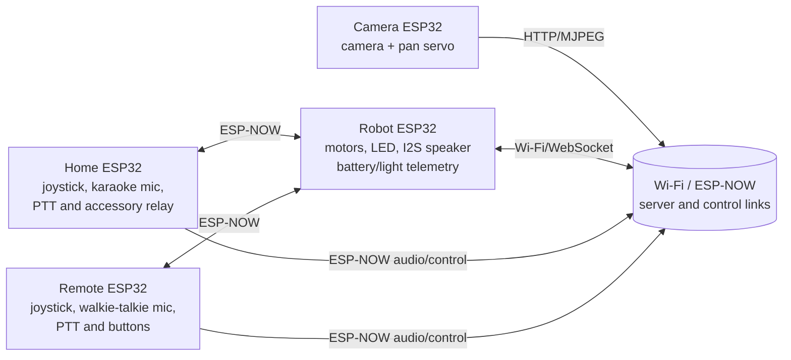
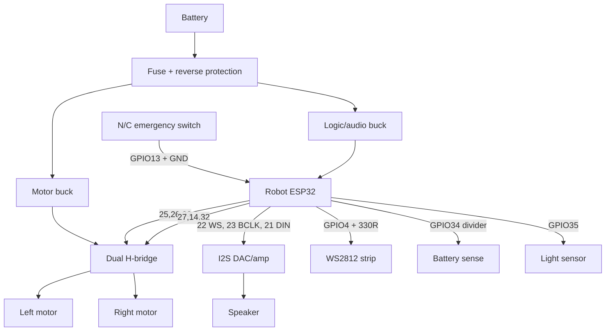
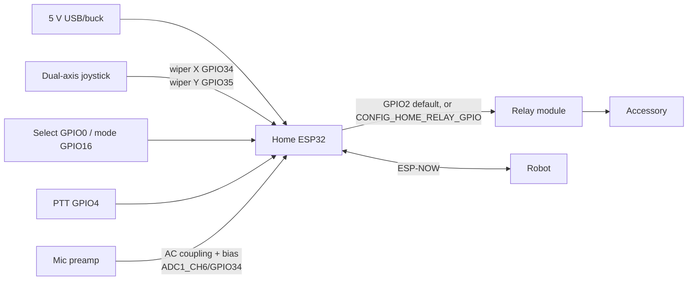
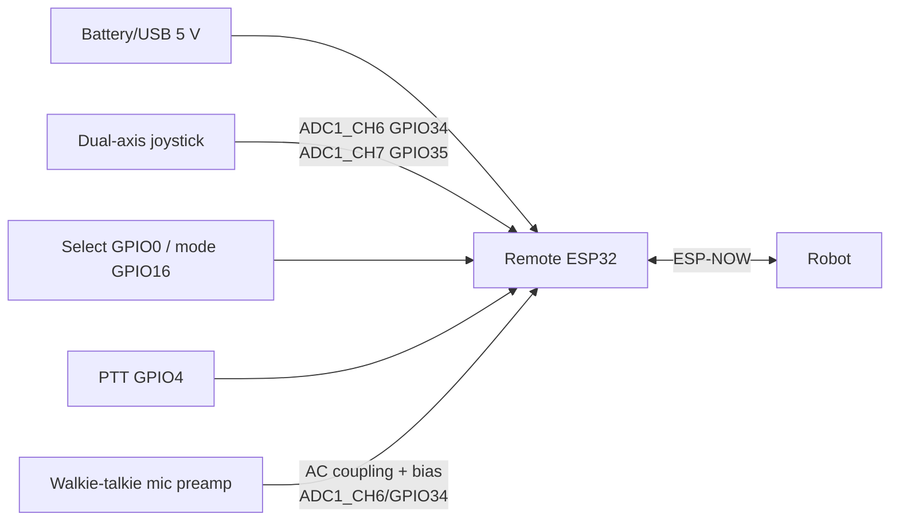
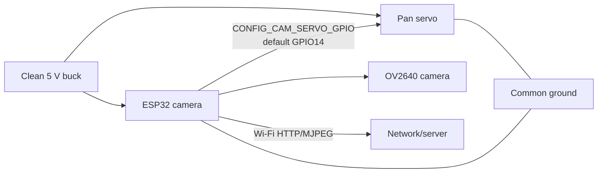

# Kaniye Phase 4 hardware

This is the build reference for the four-node Kaniye system. It describes the
current firmware pinout; do not silently move a pin on a harness. The robot
emergency input is **GPIO13**. GPIO0 is not the robot emergency input; its
other-node uses below are unrelated button/camera signals.

## System at a glance

The robot is the safety authority: a released/triggered emergency input and
the watchdog must stop the motor driver locally, even if the network or server
is down. Keep motor power and logic power grounds common, but route motor
current separately from audio and ADC wiring.

## Bill of materials

| Area | Parts | Notes |
|---|---|---|
| Controllers | 4 × ESP32 development boards (robot, home, remote, camera) | ESP32-WROOM-class boards; expose the listed GPIOs and ADC1 |
| Robot drive | Dual H-bridge motor driver, 2 × brushed DC gear motors, wheels/chassis | Driver logic must accept 3.3 V; size for motor stall current |
| Robot audio | I2S DAC/amplifier (MAX98357A or equivalent), 4–8 Ω speaker | Mono PCM16, 16 kHz |
| Robot sensing | Battery divider, light sensor/LDR module, emergency mushroom switch | Battery divider must be scaled for the selected pack |
| Lighting | WS2812B/NeoPixel strip and suitable 5 V supply | Data level shifter is recommended for long strips |
| Home audio | Electret microphone module with preamp/biased analog output; PTT switch | This is the karaoke microphone input |
| Remote audio | Electret microphone module with preamp/biased analog output; PTT switch | This is the walkie-talkie microphone input |
| Controls | 2 × 10 kΩ dual-axis joystick, push buttons, mode/PTT switches | Joystick wipers go to ADC1_CH6/CH7 |
| Camera | ESP32 camera module (OV2640 class), pan servo, external 5 V servo supply | Keep servo current off the camera 3.3 V rail |
| Power/protection | Fuses, reverse-polarity protection, buck converters, 100 nF + bulk capacitors, terminal blocks | Add a fuse close to every battery source |
| Build | 22–26 AWG signal wire, thicker motor wire, JST/screw terminals, heat-shrink | Label every connector with node, signal, and ground |

## Pin and connector tables

### Robot node (`firmware/robot_esp32/main/robot_config.h`)

| Signal | ESP32 pin | Direction | Wiring endpoint |
|---|---:|---|---|
| Emergency stop | GPIO13* | Input, pulled up | Normally-closed switch to GND; open/tripped means stop |
| Left motor forward/reverse | GPIO25 / GPIO26 | Output | H-bridge IN1 / IN2 |
| Right motor forward/reverse | GPIO27 / GPIO14 | Output | H-bridge IN3 / IN4 |
| Left/right PWM | GPIO33 / GPIO32 | Output (LEDC) | H-bridge ENA / ENB (or PWM inputs) |
| LED strip data | GPIO4 | Output | WS2812 DIN through ~330 Ω series resistor |
| I2S LRCK/WS | GPIO22 | Output | DAC LRC/WS |
| I2S BCLK | GPIO23 | Output | DAC BCLK |
| I2S data out | GPIO21 | Output | DAC DIN |
| Battery ADC | GPIO34 (ADC1) | Input only | Divider midpoint |
| Light ADC | GPIO35 (ADC1) | Input only | LDR/divider midpoint |

\* GPIO13 is the emergency-stop input and is intentionally not GPIO0. GPIO34/35
are input only; never use them to power a sensor.

### Home controller node (`firmware/home_esp32`)

| Signal | ESP32 pin/channel | Direction | Wiring endpoint |
|---|---|---|---|
| Joystick X / Y | GPIO34 / GPIO35 (ADC1_CH6/CH7) | Analog input | 10 kΩ joystick wipers |
| Select button | GPIO0 | Active-low input | Button to GND; boot strap pin |
| Mode button | GPIO16 | Active-low input | Button to GND |
| PTT | GPIO4 | Active-low input | Karaoke PTT switch to GND |
| Karaoke microphone | ADC1_CH6 (GPIO34 in current source) | Analog input | AC-coupled, biased mic preamp output |
| Accessory relay | `CONFIG_HOME_RELAY_GPIO`, default GPIO2 | Output | Relay-module IN; default off |

The current implementation samples the karaoke microphone on ADC1_CH6, which
is also the joystick-X channel. Treat karaoke as a mutually exclusive mode
(movement is disabled while karaoke is active), or reserve a future ADC pin and
update firmware before building a simultaneous-control harness. The Kconfig
`HOME_PTT_ADC_CHANNEL` and `HOME_AUDIO_THRESHOLD` values are tuning knobs; the
input source currently uses ADC1_CH6 directly.

### Remote controller node (`firmware/remote_esp32`)

| Signal | ESP32 pin/channel | Direction | Wiring endpoint |
|---|---|---|---|
| Joystick X / Y | GPIO34 / GPIO35 (ADC1_CH6/CH7) | Analog input | 10 kΩ joystick wipers |
| Select button | GPIO0 | Active-low input | Button to GND; boot strap pin |
| Mode button | GPIO16 | Active-low input | Button to GND |
| PTT | GPIO4 | Active-low input | Walkie-talkie PTT switch to GND |
| Walkie-talkie microphone | ADC1_CH6 (GPIO34 in current source) | Analog input | AC-coupled, biased mic preamp output |

The remote audio sampler and joystick-X both use ADC1_CH6 in the current
firmware. Do not expect clean simultaneous joystick-X and microphone readings;
use PTT/mode to arbitrate, or change the firmware and harness together.
`REMOTE_PTT_ADC_CHANNEL` is configuration metadata for future audio hardware.

### Camera node (`firmware/esp32_cam`)

| Signal | ESP32 pin/config | Direction | Wiring endpoint |
|---|---|---|---|
| Camera XCLK | GPIO0 | Output | OV2640 XCLK |
| Camera SCCB SDA / SCL | GPIO26 / GPIO27 | Bidirectional | OV2640 SIOD / SIOC |
| Camera D0 / D1 | GPIO5 / GPIO18 | Input | OV2640 Y2 / Y3 |
| Camera D2 / D3 | GPIO19 / GPIO21 | Input | OV2640 Y4 / Y5 |
| Camera D4 / D5 | GPIO36 / GPIO39 | Input | OV2640 Y6 / Y7 |
| Camera D6 / D7 | GPIO34 / GPIO35 | Input | OV2640 Y8 / Y9 |
| Camera VSYNC / HREF / PCLK | GPIO25 / GPIO23 / GPIO22 | Input | OV2640 VSYNC / HREF / PCLK |
| Pan servo | `CONFIG_CAM_SERVO_GPIO`, default GPIO14 | Output | Servo signal |
| Servo power | External 5 V | Power | Servo red wire; common GND with ESP32 |

These camera pins are the current `camera_service.c` mapping for the supported
OV2640 board. They are not interchangeable with the robot's GPIO table.

## Wiring, passive components, and power

1. **Ground and rails.** Use a star ground at the battery/regulator entry.
   Use a dedicated buck for motors/driver and a clean 5 V-to-3.3 V regulator
   for ESP32/audio. Tie grounds at one low-impedance point. Never power a
   motor, relay coil, strip, or servo from an ESP32 3.3 V pin.
2. **Decoupling.** Place 100 nF ceramic at every module VCC/GND pair; add
   470–1000 µF low-ESR electrolytic at the motor-driver rail, 470 µF at a
   WS2812 strip entry, and 470 µF near the servo supply. Add 10 µF bulk at
   each regulator output. Observe capacitor voltage ratings.
3. **Motors and relay.** Follow the H-bridge datasheet, fit its required
   flyback protection, and use a fuse sized below the wiring limit. A bare
   relay coil requires a transistor/MOSFET and flyback diode; a relay module
   normally includes these. Keep GPIO2's relay default low during boot.
4. **Emergency stop.** Wire the normally-closed switch in series to ground
   with a 10 kΩ pull-up (internal pull-up may supplement, not replace, a
   defined external pull-up). Put the stop in the driver-enable/power path as
   a second hardware layer; firmware GPIO13 is not the only safety barrier.
5. **ADC inputs.** Keep analog leads short and away from PWM/motor wires.
   Use a 1 kΩ series resistor and 100 nF to GND at each ADC input (one RC
   filter per signal). Joystick ends use 3.3 V and GND. Never exceed the
   ESP32 ADC input range; choose battery-divider values accordingly (for
   example 100 kΩ high side / 33 kΩ low side for a 4-cell nominal pack only
   after checking the pack's maximum voltage).
6. **Buttons and PTT.** Firmware enables internal pull-ups; wire each
   active-low switch to GND. Add an optional 100 nF across a long/cabled
   switch and debounce in firmware. GPIO0 is a boot strap: hold its button
   released while powering/flashing.
7. **Audio/I2S.** Keep I2S traces short, ground-referenced, and separate from
   motor PWM. The DAC should have its own 100 nF + 10 µF local bypass. Connect
   speaker only to the amplifier output, never to an ESP32 pin.
8. **Logic protection.** Confirm every peripheral is 3.3 V logic. Use a
   74AHCT/level-shifter stage for a 5 V LED strip data line when the strip is
   long or unreliable. Add TVS/ESD protection at external connectors.

## Node wiring diagrams

### Robot

### Home (karaoke)

### Remote (walkie-talkie)

### Camera

## Walkie-talkie and karaoke audio tuning

Use an electret capsule with a real preamp (or a MAX9814/MAX4466-style module)
whose output is biased near 1.65 V and never clips the 0–3.3 V ADC range. Put
1–4.7 µF in series from the preamp output to the ADC and a 100 kΩ/100 kΩ
divider (or equivalent bias network) on the ESP32 side. Start with preamp gain
low, speak 10–15 cm from the capsule, and raise gain until loud speech peaks
around 70–85% of ADC full scale without clipping.

For the **walkie-talkie**, mount the capsule away from the motor/servo and use
PTT as the hard audio gate. Tune `REMOTE_COMMAND_TIMEOUT_MS` conservatively
and verify that releasing PTT immediately ends transmission. For the **karaoke
mic**, use a foam windscreen, keep the capsule 5–15 cm from the singer, and
adjust `HOME_AUDIO_THRESHOLD` above fan/room noise but below quiet speech.
Karaoke mode must inhibit movement because its current ADC channel is shared
with joystick X.

At the bench, record ADC idle, normal speech, and shouting values; choose the
threshold from the idle-to-speech gap, then test with the motors, LED strip,
relay, and servo operating simultaneously. If hum or motor hash appears, fix
grounding/decoupling and cable routing before increasing software thresholds.
